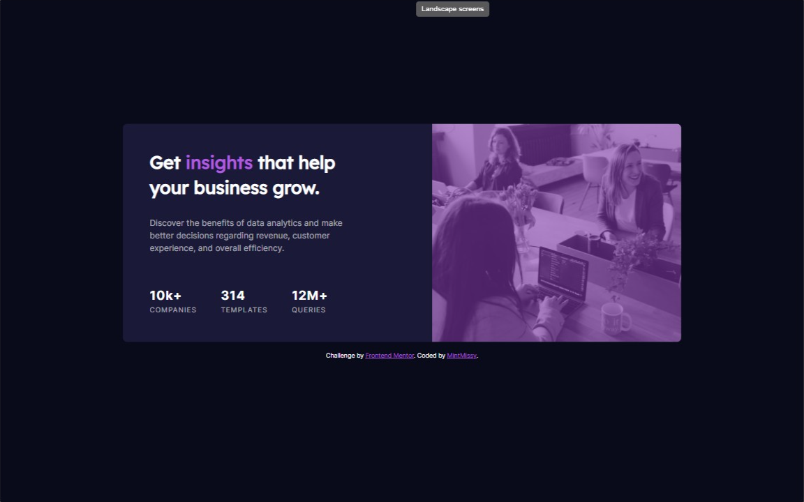

# Frontend Mentor - Stats preview card component

### Design Screenshot

### Result Screenshot

## The challenge

Your users should be able to:

- View the optimal layout depending on their device's screen size channel.

### Built with

- Semantic HTML5 markup
- SCSS custom properties
- Flexbox

### What I learned

I learned that how to make tinted image. At first I did think that it's easy but then it became a little trouble for me. After I realized that I can use after object everything was easy and clear.
